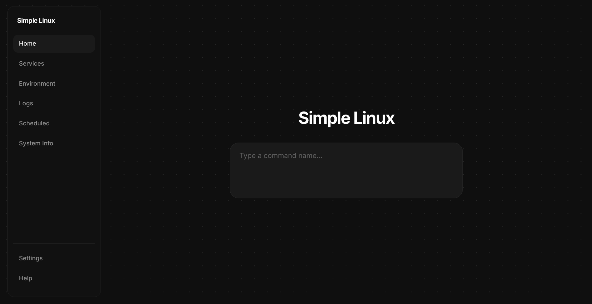
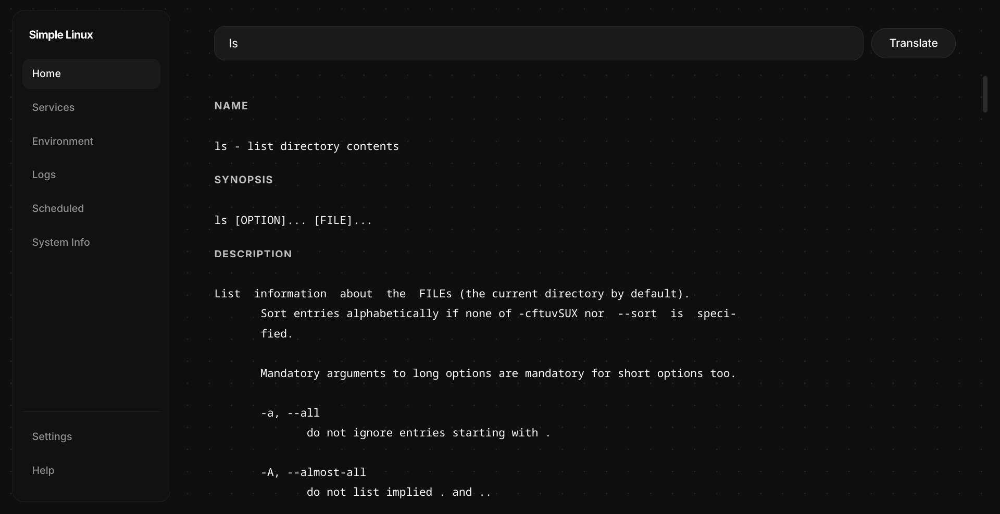
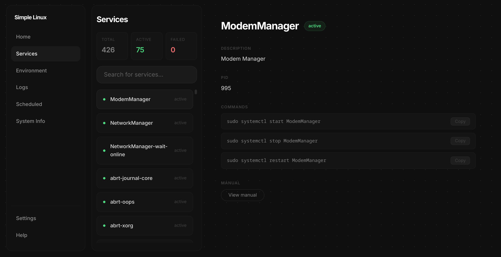
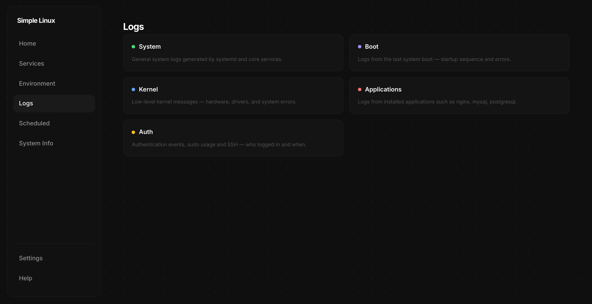
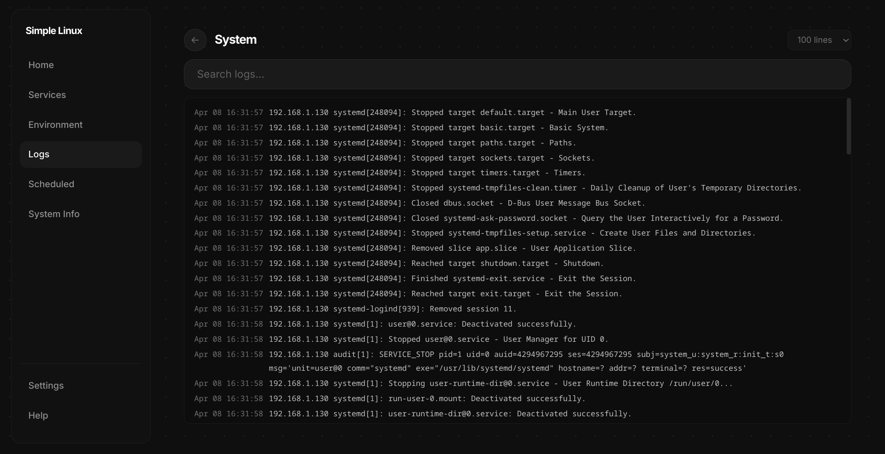
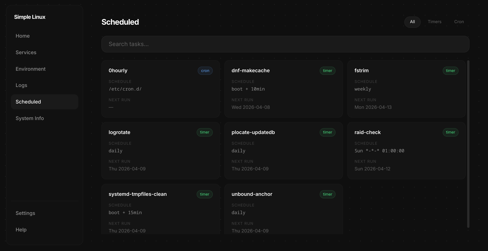
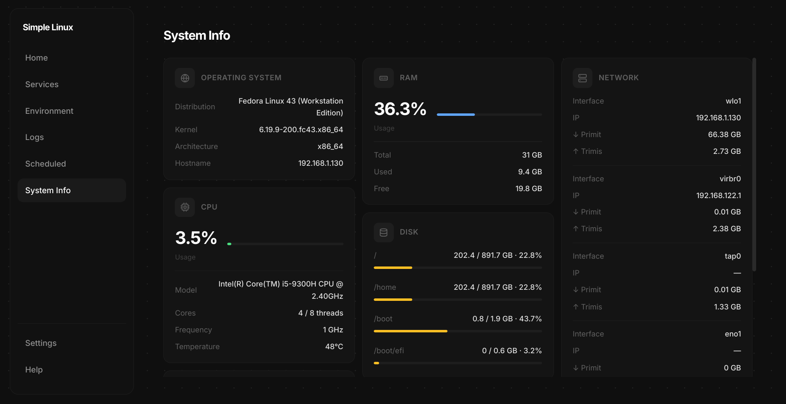
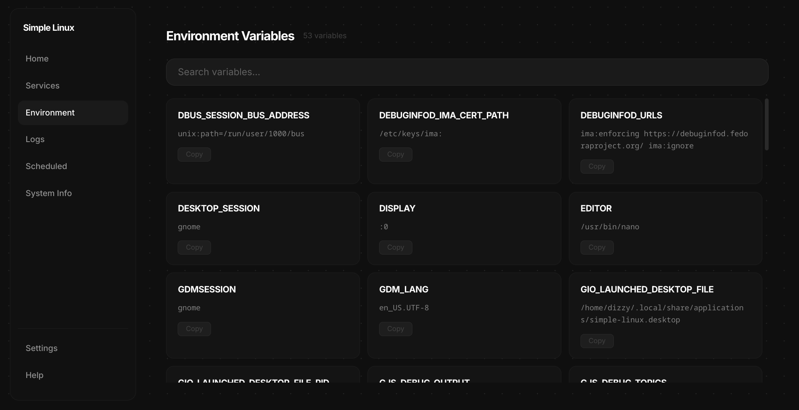
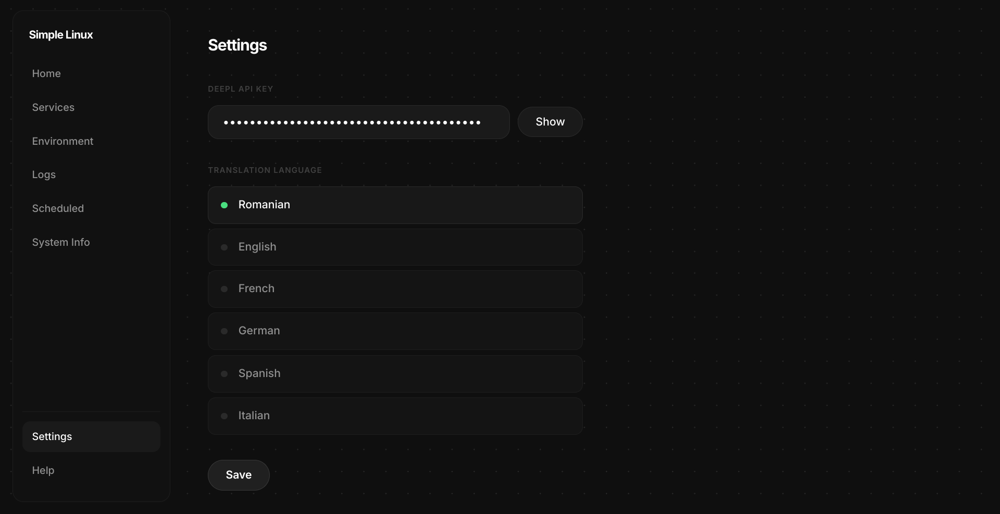

# Simple Linux

Simple Linux started as a simple man page viewer. Over time it grew into a broader tool for exploring and understanding a Linux system — built for beginners, useful for everyone.



---

## For Beginners

Simple Linux gives you a clean, simple interface to explore your Linux system without needing to know terminal commands. Think of it as a visual guide to what's happening on your computer.

Simple Linux is designed as a starting point, not a permanent tool. The goal is to help you understand your system visually first — and then gradually move to using the terminal directly. Every piece of information shown in this app can also be obtained through terminal commands, and learning those commands is the natural next step.

### What can you do with it?

- **Look up any command** — type a command name and read its manual in plain text
- **Translate manual pages** — select any text and translate it instantly with DeepL
- **Explore your services** — see what's running on your system and how to manage it
- **Browse environment variables** — understand what's configured on your system
- **Read system logs** — see what your system has been doing, organized by category
- **View scheduled tasks** — see what runs automatically and when
- **Monitor hardware** — check CPU, RAM, GPU, disk and network usage in real time

> **A note on processes:** For processes, the standard Linux tools are `htop` and `btop`. Simple Linux does not include a process manager because these tools cannot be replaced — they are faster, more powerful, and learning to use them is part of understanding Linux.

### Installation

```bash
git clone https://github.com/Dizzy123q/simple-linux.git
cd simple-linux
./install.sh
```

After installation, search for **Simple Linux** in your applications menu or run:

```bash
simple-linux
```

### Requirements

- Linux (Fedora, Ubuntu or Arch based)
- Python 3.10+
- Internet connection (only for DeepL translation)

### Screenshots

| | |
|---|---|
|  |  |
| **Home** — look up any command manual | **Services** — browse and manage systemd services |
|  |  |
| **Logs** — choose a log category | **Logs** — read and search log output |
|  |  |
| **Scheduled** — view timers and cron jobs | **System Info** — real-time hardware monitoring |
|  |  |
| **Environment** — browse environment variables | **Settings** — configure DeepL translation |

---

## For Developers

### Tech Stack

| Layer | Technology |
|---|---|
| Backend | Python 3.10+ |
| Frontend | HTML, CSS, JavaScript (vanilla) |
| Desktop bridge | pywebview 6.x |
| GUI backend | PyQt6 + PyQt6-WebEngine |
| Local server | Python `http.server` (port 8765) |
| System info | psutil |
| Translation | DeepL API |
| Scheduling | systemd + cron via subprocess |

### Architecture

The app runs a local HTTP server that serves static HTML/CSS/JS files. pywebview wraps this in a native desktop window using Qt. The frontend communicates with the Python backend through pywebview's JS bridge (`window.pywebview.api`).

```
┌─────────────────────────────────────────┐
│              PyQt6 Window               │
│  ┌───────────────────────────────────┐  │
│  │        pywebview (WebEngine)      │  │
│  │  ┌────────────┐  ┌─────────────┐ │  │
│  │  │  HTML/CSS  │  │ JavaScript  │ │  │
│  │  │    UI      │  │   Pages     │ │  │
│  │  └────────────┘  └──────┬──────┘ │  │
│  └─────────────────────────┼────────┘  │
│                    JS Bridge│           │
│  ┌──────────────────────────▼────────┐ │
│  │           Python API              │ │
│  │  services / logs / man / sysinfo  │ │
│  └───────────────────────────────────┘ │
└─────────────────────────────────────────┘
```

### Project Structure

```
simple-linux/
├── simple_linux/
│   ├── api.py              # API class exposed to JS via pywebview
│   ├── main.py             # Entry point — starts HTTP server and window
│   ├── logic/
│   │   ├── config.py       # Load/save config.json
│   │   ├── logs.py         # journalctl log fetching and parsing
│   │   ├── man_parser.py   # man page fetching and section parsing
│   │   ├── scheduled.py    # systemd timers and cron job reading
│   │   ├── services_manager.py  # systemctl service listing and details
│   │   ├── system_info.py  # CPU, RAM, GPU, disk, network via psutil
│   │   └── translator.py   # DeepL API integration
│   └── ui/
│       ├── index.html      # Single page app shell
│       ├── style.css       # All styles
│       ├── app.js          # Navigation and zoom logic
│       └── pages/          # One JS file per page
│           ├── home.js
│           ├── services.js
│           ├── env.js
│           ├── logs.js
│           ├── scheduled.js
│           ├── sysinfo.js
│           ├── settings.js
│           └── help.js
├── install.sh              # Installer for Fedora, Ubuntu and Arch
├── requirements.txt
└── setup.py
```

### Design Decisions

**Why pywebview?** It gives a native desktop window without Electron's overhead, using the system's existing Qt/WebEngine stack.

**Why a local HTTP server?** pywebview requires a URL to load — serving files locally avoids file:// protocol limitations and makes development easier.

**Why vanilla JS?** No build step, no bundler, no dependencies — the frontend is just static files served directly. This keeps the project simple and easy to understand.

**Why subprocess for system data?** Most Linux system information is most reliably accessed through standard CLI tools (systemctl, journalctl, man) rather than through Python libraries that may not be available on all distributions.

**Why no process manager?** Tools like `htop`, `btop` and `ps` are the standard for process management on Linux — they are more complete, more precise, and deeply integrated with the system. A graphical process manager inside Simple Linux would duplicate functionality that already exists and is done better by dedicated tools. Simple Linux encourages users to learn and use these tools directly.

### Running from Source

```bash
git clone https://github.com/Dizzy123q/simple-linux.git
cd simple-linux
python -m venv venv
source venv/bin/activate
pip install -r requirements.txt
python simple_linux/main.py
```

### License

MIT
